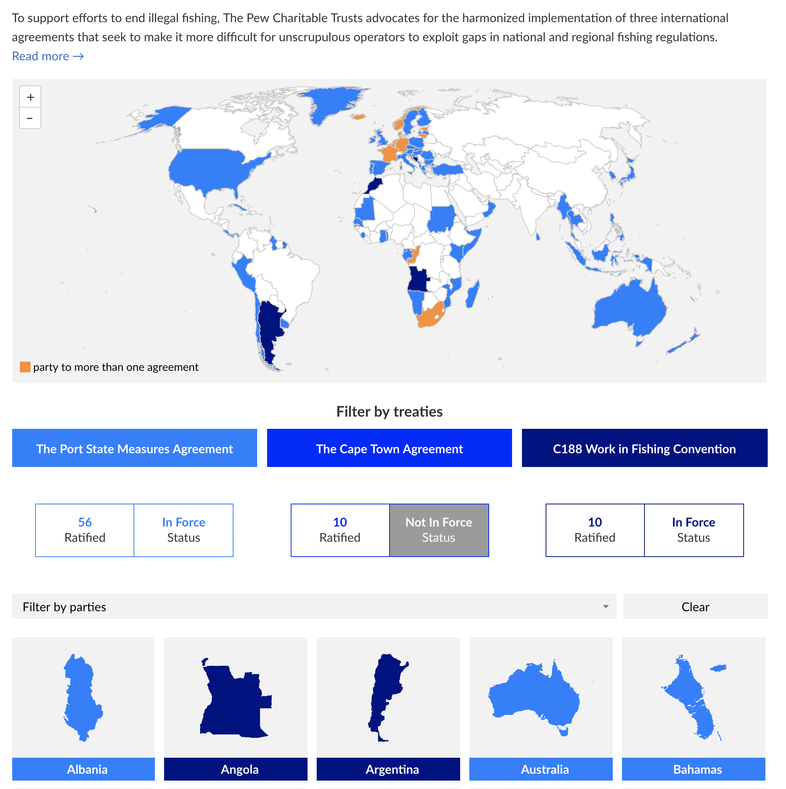
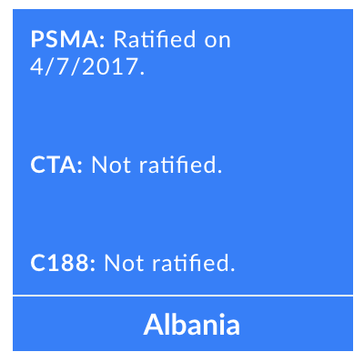

[codebase]: [https://bitbucket.org/pctdigital/cape-town/src/master/]
[preview]: [https://pctdigital.bitbucket.io/preview/cape-town/]
[live]: [https://www.pewtrusts.org/en/research-and-analysis/data-visualizations/2018/three-treaties-to-end-illegal-fishing]

# The Ending Illegal Fishing Program's "Three Treaties" data visualization

[Live version][live]

A data viz showing which countries have signed on to which of three international treaties to combat illegal fishing. Users select a countries by clicking on a map, by selecting from a dropdown, or by text search.  Users filter which treaties filtered in or out by toggling buttons. Matching countries are color-coded in the map and revealed as tiles in the results sections. Clicking or hovering over a country's tile reveals its details for each treaty.

## How to build and publish

1. You need to have [node and npm installed](https://blog.teamtreehouse.com/install-node-js-npm-mac) on your machine
1. You need to have [git installed](https://git-scm.com/book/en/v2/Getting-Started-Installing-Git) on your machine.
1. `git clone` the [Bitbucket repository][codebase] onto your machine
1. `cd` into the local directory and run `npm install` to install the project's development dependencies
1. run `npm run build` to package the build files into the `dist/` folder
1. `cd` into the the `dist/` folder and put its contents into a zip file: `zip EIFP.zip -r ./`
1. upload the zip file to Sitecore's Media Library. 
1. copy the content from index.html and paste it into the Third Party Embed for the page content

## How to update the data

The data are in four files:

* `countries.csv`: the main data for countries that are not overseas territories of another. Fields: iso_a3, treaty_id, ratified_date, note. The note column for now consists only of the number of vessels, relevant to the Capetown Agreement.

* `country-codes.json`: dictionary with country codes as the keys and country names and the values

* `eu-countries.json`: an array of EU member state country codes

* `overseas-territories.json`: multidimensional JSON object keyed my country codes of overseas territories. Each territory's value is an object specifying the territory's mainland country and an array of the treaties to which the territory is party as a result of action taken by the mainland country. Currently the Port States Measures Agreement is the only relevant value.

* `treaties.json`:  An array of objects representing each treaty, its code, its name, and its status

**Only `countries.csv` can be updated without rebuilding the files.** That is, you can update the file and directly replace the existing file on Sitecore. The app fetches the data from that file at runtime and compares a simple hash of the runtime data contents with a hash taken during the build process. If the hashes do not match, the views that depend on the data are rerendered.

This process will work but will result in the live files not matching the master repository. Rebuilding the `dist/` folder when there's new data would avoid that.

If a change to the data adds a country not present in the original, the SVG image of that country will not be available. The globe image will be used instead, until the SVG is added to the code and the source code rebuilt into `dist/`.

The other data files must be updated as source files only. The build process injects the data in those files into the main script for the app. Change the source file and repeat the How to Build and Publish instructions.

## How to edit

1. You need to have [node and npm installed](https://blog.teamtreehouse.com/install-node-js-npm-mac) on your machine
1. You need to have [git installed](https://git-scm.com/book/en/v2/Getting-Started-Installing-Git) on your machine.
1. `git clone` the [Bitbucket repository][codebase] onto your machine
1. `cd` into the local directory and run `npm install` to install the project's development dependencies
1. Run `npm run start` to fire up the development server. The app will open in your browser on localhost.
1. Make your edits. `git commit` them.

## Notes on the technology 

Third parties:
* D3 collections for nesting and manipulating data
* [Highmaps](https://api.highcharts.com/highmaps/)
* [PapaParse](https://www.papaparse.com/) for reliable parsing of the CSV

The rest is in frameworkless JavaScript, making use of ES2016 syntax and APIs, including importing and export modules. Webpack runs the code through Babel for noncompliant browsers and bundles the output.

The build process prerenders `index.html` . The same scripts in effect are run twice, once at build and again at runtime. At runtime, the needed DOM elements already are renders; they just need to be "rehydrated" by the JavaScript. This is by far the most confusing part of the code, with logic throughout to see if a component's container already exists or not or whether the environment in the prerenderer's headless browser or a client browser.